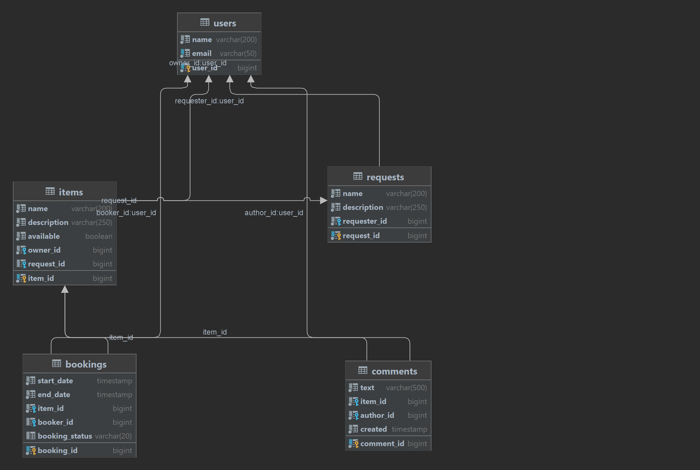

# java-shareit
ShareIt Project
Приложение для добавления пользователями своих вещей для сдачи в аренду и возможности брать в аренду вещи других пользователей
Spring Boot 2.7, Maven, PostgreSQL, Lombok, Spring JPA, REST, Docker

Приложение состоит из двух модулей:
Gateway - проводит первичную валидацию запросов пользователей и перенаправляет корректные запросы на сервер.
Server - принимает REST запросы от Gateway, обрабатывает, сохраняет или находит в БД и возвращает требуемые данные.

Приложение развертывается в трех контейнерах: db, server, gateway.

## Схема БД 

